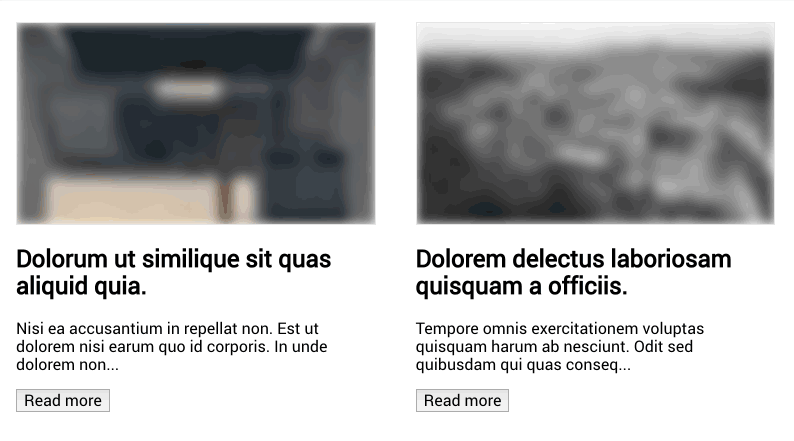

# vue-progressive-image

Vue progressive image loading plugin





## Installation

```bash
$ npm install vue-progressive-image
```

## Usage

```js
import Vue from 'vue'
import VueProgressiveImage from 'vue-progressive-image'

Vue.use(VueProgressiveImage)
```

In the template then, instead of using the normal `img` tag to load images, use the `progressive-image` component

```html
<progressive-image source="https://unsplash.it/1920/1080" />
```

## Placeholders

To be able to immediately show some feedback to the user, it is possible to pass a placeholder image, which should be really small, something arount 48x27px for example, depending on the aspect ratio of the main image.

The placeholder will be blurred and displayed almost instantly.

```html
<progressive-image
  source="https://unsplash.it/1920/1080?image=0"
  placeholder="https://unsplash.it/48/27?image=0"
/>
```

### Blur

It is possible to adjust the level of blur applied to the placeholder image

```html
<progressive-image
  source="https://unsplash.it/1920/1080?image=0"
  placeholder="https://unsplash.it/48/27?image=0"
  blur="30"
/>
```

## Options

During the installation process it is possible to pass some default global options

**Global options will be applied only to components that don't specify their own options**


#### placeholder
*	type: String
*	required: false

```js
Vue.use(VueProgressiveImage, {
  placeholder: 'https://unsplash.it/1920/1080?image=20'
})
```

#### blur
*	type: Number
* required: false
*	default: 5

```js
Vue.use(VueProgressiveImage, {
  blur: 30
})
```
